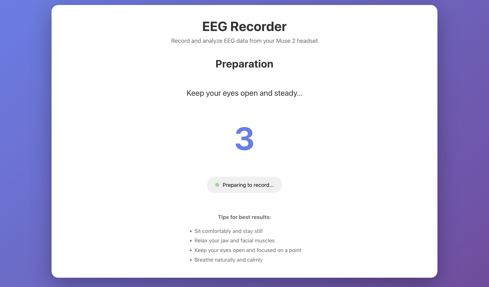

# 🧠 EEG Recorder App

[](https://opensource.org/licenses/ISC)
[](https://reactjs.org/)
[](https://www.python.org/)
[](https://developer.mozilla.org/en-US/docs/Web/API/Web_Bluetooth_API)

**Record and analyze your brain activity in minutes—no complex software required.**

A complete web-based solution for recording EEG data from the Muse 2 headset and processing it with scientific-grade analysis. Built with [web-muse](https://github.com/itayinbarr/web-muse), this app lets you collect and analyze EEG data entirely in your browser, then dive deeper with our Python post-processing pipeline.


_Example output: Raw signal, filtered signal, and power spectral density analysis_

## 📸 App Screenshots

The app guides you through four intuitive phases:

### 1️⃣ Setup Phase - Connect Your Muse 2

<table>
<tr>
<td width="50%">

<p align="center"><em>Initial setup screen - ready to connect</em></p>
</td>
<td width="50%">

<p align="center"><em>Connected!</em></p>
</td>
</tr>
</table>

### 2️⃣ Preparation Phase - Get Ready


_Configure your recording duration_

### 3️⃣ Recording Phase - Capture Your Brain Activity



_5-second countdown with helpful tips to ensure quality recording_

### 4️⃣ Results Phase - Visualize & Export

<table>
<tr>
<td width="33%">

<p align="center"><em>Real-time progress tracking during your recording session</em></p>
</td>
<td width="33%">

<p align="center"><em>Beautiful EEG visualization</em></p>
</td>
<td width="33%">

<p align="center"><em>Detailed channel statistics, download your data as CSV</em></p>
</td>
</tr>
</table>

## ✨ Why This App?

- 🚀 **No Installation Required**: Record EEG directly in your browser—just open and connect
- 🎯 **Beginner Friendly**: Guided workflow takes you from connection to analysis in minutes
- 🔬 **Research-Grade**: Scientific analysis pipeline with artifact removal and band power extraction
- 📊 **Complete Solution**: From raw recording to publication-ready metrics
- 🆓 **Open Source**: Free, transparent, and customizable

## 🎯 What Can You Do?

- **Track Meditation Progress**: Monitor alpha and theta waves during meditation
- **Study Focus & Attention**: Analyze beta waves during cognitive tasks
- **Sleep Research**: Examine delta waves and sleep stages
- **Neurofeedback Training**: Real-time brain state monitoring
- **Education**: Learn about brain signals hands-on
- **Research Projects**: Collect EEG data for experiments

## ⚡ Quick Start

### 1. Record EEG (2 minutes)

```bash
npm install
npm run dev
```

Open **https://localhost:3000**, connect your Muse 2, and start recording!

### 2. Analyze Data (3 minutes)

```bash
cd post-recording
./install.sh
source venv/bin/activate
python process_eeg.py ../data/your_recording.csv
```

Get instant results: band powers, clinical ratios, and beautiful visualizations.

→ **[Full Quick Start Guide](QUICKSTART.md)**

## 🎨 Features

### 📱 Web Recording App

- 🎯 **One-Click Connection**: Connect to Muse 2 via Web Bluetooth—no drivers needed
- ⏱️ **Flexible Recording**: Set duration from 1 to 300 seconds
- 🧘 **Guided Process**: Preparation countdown with helpful tips
- 📊 **Live Visualization**: See your brain waves in real-time
- 💾 **Instant Export**: Download CSV with all 4 channels
- 📈 **Quality Metrics**: Review statistics for each electrode

### 🔬 Post-Processing Pipeline

- 🧹 **AutoReject**: Automatic artifact detection and removal
- 📊 **Power Analysis**: Welch's method PSD with customizable parameters
- 🎵 **Frequency Bands**: Delta, Theta, Alpha, Beta, Gamma
- 🖼️ **Visualizations**: 4-panel summary plots
- 💾 **Standard Formats**: Export to EDF for use with other tools

## 🛠️ Built With

### Core Technologies

- **[web-muse](https://github.com/itayinbarr/web-muse)**: Modern JavaScript library for Muse EEG connectivity
  - Active development and maintenance
  - Web Bluetooth API integration
  - Works with current Muse firmware
  - Includes React hooks and context
- **React 18**: Modern, responsive UI
- **Vite**: Fast development with HTTPS support
- **MNE-Python**: Gold-standard EEG analysis library
- **AutoReject**: Automated artifact removal

### About web-muse

This app uses the [web-muse](https://github.com/itayinbarr/web-muse) library (included in the `web-muse/` folder) for connecting to Muse devices via Web Bluetooth. Unlike older libraries like muse-js, web-muse is actively maintained and works reliably with modern Muse firmware. It provides a clean API and React hooks for easy integration.

## 📋 Prerequisites

- **Hardware**: Muse 2 or Muse S headset
- **Browser**: Chrome, Edge, or Opera (Web Bluetooth required)
- **Software**:
  - Node.js v18+ (for web app)
  - Python 3.8+ (for analysis, optional)

## Installation

1. Install dependencies:

```bash
npm install
```

## Running the App

1. Start the development server:

```bash
npm run dev
```

2. Open your browser to `https://localhost:3000`

3. Accept the self-signed certificate warning (required for local HTTPS)

## Usage

### 1. Setup Phase

- Click "Connect Muse 2 Headset" to pair with your device
- Set your desired recording duration (1-300 seconds)
- Click "Start Recording Session"

### 2. Preparation Phase

- Follow the on-screen tips to prepare for recording
- 5-second countdown before recording begins
- Stay still and relaxed

### 3. Recording Phase

- Keep your eyes open and focused
- Stay still during the recording
- Watch the countdown timer
- Progress bar shows recording progress

### 4. Results Phase

- View your EEG data plotted with offset channels
- Review statistics for each electrode:
  - **TP9**: Left ear electrode
  - **AF7**: Left forehead electrode
  - **AF8**: Right forehead electrode
  - **TP10**: Right ear electrode
- Download your data as CSV
- Start a new recording if desired

## CSV Format

The exported CSV file contains:

- **Column 1**: Timestamp (milliseconds)
- **Column 2**: TP9 - Left ear (µV)
- **Column 3**: AF7 - Left forehead (µV)
- **Column 4**: AF8 - Right forehead (µV)
- **Column 5**: TP10 - Right ear (µV)

Sample rate: ~256 Hz

## Technical Details

### Architecture

- **Frontend**: React 18 with Vite
- **Connection**: Web Bluetooth API via web-muse library
- **Visualization**: HTML5 Canvas
- **Data Export**: Client-side CSV generation

### EEG Channels

The Muse 2 headset provides 4 main EEG channels:

1. **TP9**: Left temporal position (behind left ear)
2. **AF7**: Left frontal position (left forehead)
3. **AF8**: Right frontal position (right forehead)
4. **TP10**: Right temporal position (behind right ear)

### Data Processing

- Raw EEG data is collected at 256 Hz
- Each sample is timestamped relative to recording start
- Data is stored in memory during recording
- Visualization uses offset plotting for clear channel separation

## Troubleshooting

### Connection Issues

- Ensure your Muse 2 is powered on and in pairing mode
- Make sure Bluetooth is enabled on your computer
- Try refreshing the page and connecting again
- Use Chrome, Edge, or Opera (Firefox doesn't support Web Bluetooth)

### HTTPS Required

- Web Bluetooth only works over HTTPS
- The dev server is configured for HTTPS
- You may need to accept the self-signed certificate

### No Data Collected

- Ensure the headset is properly fitted
- Check that all electrodes are making good contact
- Try moistening the electrode contacts slightly

## 🌐 Browser Compatibility

| Browser | Supported | Notes            |
| ------- | --------- | ---------------- |
| Chrome  | ✅ Yes    | Recommended      |
| Edge    | ✅ Yes    | Full support     |
| Opera   | ✅ Yes    | Full support     |
| Firefox | ❌ No     | No Web Bluetooth |
| Safari  | ❌ No     | No Web Bluetooth |

## 🚀 Deployment

### Building for Production

```bash
npm run build
```

The built files will be in the `dist` directory.

### Deployment Options

The app can be deployed to any static hosting service that supports HTTPS (required for Web Bluetooth):

#### Option 1: GitHub Pages

1. Build the app: `npm run build`
2. Deploy the `dist` folder to GitHub Pages
3. Ensure HTTPS is enabled (automatic on GitHub Pages)

#### Option 2: Vercel

1. Connect your GitHub repository to Vercel
2. Vercel will automatically detect Vite and build
3. Deploy with one click

#### Option 3: Netlify

1. Connect your repository or drag-and-drop the `dist` folder
2. Build command: `npm run build`
3. Publish directory: `dist`

#### Option 4: Your Own Server

1. Build the app: `npm run build`
2. Upload `dist` folder to your server
3. **Important**: Configure HTTPS (required for Web Bluetooth)
4. Serve files with any static web server (nginx, Apache, etc.)

### HTTPS Requirement

⚠️ **Web Bluetooth requires HTTPS.** Make sure your deployment:

- Uses HTTPS (not HTTP)
- Has a valid SSL certificate
- Serves from `https://` or `localhost`

Most modern hosting services provide HTTPS by default.

## 🔬 Post-Processing Your Recordings

After recording EEG data, process it with our scientific-grade Python pipeline to extract meaningful insights.

### Step-by-Step Guide

#### 1. Install Post-Processing Tools (One Time Only)

```bash
cd post-recording
./install.sh
```

This creates a Python virtual environment and installs all required dependencies (MNE-Python, AutoReject, etc.).

#### 2. Move Your Recording to the Data Folder

After recording in the web app, your CSV file downloads to your Downloads folder. Move it to the `data/` folder:

```bash
# Option A: Using command line
mv ~/Downloads/eeg_recording_*.csv data/

# Option B: Manually
# Drag and drop the CSV file from Downloads into the 'data' folder
```

#### 3. Activate the Python Environment

```bash
source post-recording/venv/bin/activate
```

You should see `(venv)` appear in your terminal prompt.

#### 4. Run the Processing Pipeline

```bash
python post-recording/process_eeg.py data/eeg_recording_YYYY-MM-DDTHH-MM-SS.csv
```

**Example with actual filename:**

```bash
python post-recording/process_eeg.py data/eeg_recording_2025-10-07T22-30-47.csv
```

**Pro tip:** Use tab completion! Type `python post-recording/process_eeg.py data/eeg_` and press Tab to autocomplete.

#### 5. View Your Results

The pipeline will automatically generate:

- ✅ `<filename>.edf` - Standard EDF format (universal compatibility)
- ✅ `<filename>_band_powers.csv` - Detailed band powers per epoch and channel
- ✅ `<filename>_summary.csv` - Summary statistics averaged by channel
- ✅ `<filename>_summary_plot.png` - 4-panel visualization (see example above)

All files are saved in the same `data/` folder as your input CSV.

### What the Pipeline Does

1. **Converts CSV to EDF** - Standard format compatible with other EEG tools
2. **Applies Bandpass Filter** - 1.0-40 Hz to remove noise
3. **AutoReject Preprocessing** - Automatically detects and removes bad epochs
4. **Welch PSD Analysis** - Calculates power spectral density (2s window, 1s overlap)
5. **Band Power Extraction** - Computes Delta, Theta, Alpha, Beta, Gamma powers
6. **Generates Visualization** - Creates comprehensive 4-panel summary plot

### Example Output

```
Processing: data/eeg_recording_2025-10-07T22-30-47.csv
✓ Converted to EDF format
✓ Preprocessing complete (20% epochs rejected)
✓ PSD analysis complete
✓ Band powers calculated
✓ Results saved

Output files:
  - data/eeg_recording_2025-10-07T22-30-47.edf
  - data/eeg_recording_2025-10-07T22-30-47_band_powers.csv
  - data/eeg_recording_2025-10-07T22-30-47_summary.csv
  - data/eeg_recording_2025-10-07T22-30-47_summary_plot.png
```

### Batch Processing Multiple Files

Process all recordings at once:

```bash
python post-recording/batch_process.py data/
```

This will process every `eeg_recording_*.csv` file in the data folder.

### Need More Details?

See [post-recording/README.md](post-recording/README.md) for:

- Custom frequency bands
- Advanced parameters
- Troubleshooting
- Individual script usage

## 📁 Project Structure

```
eeg-recorder-app/
├── src/                    # React app source code
│   ├── components/         # React components (4 recording phases)
│   ├── utils/             # Data recording and CSV export utilities
│   ├── App.jsx            # Main app component
│   └── styles.css         # Modern UI styling
├── web-muse/              # Web Bluetooth Muse connectivity library
├── post-recording/        # Python post-processing pipeline
│   ├── process_eeg.py     # Main processing script
│   ├── csv_to_edf.py      # CSV to EDF converter
│   ├── preprocessing.py   # AutoReject preprocessing
│   ├── psd_analysis.py    # PSD and band power analysis
│   ├── visualization.py   # Summary plot generation
│   └── README.md          # Post-processing documentation
├── data/                  # Your recorded EEG data (gitignored)
├── README.md              # This file
├── QUICKSTART.md          # 10-minute getting started guide
└── PROJECT_SUMMARY.md     # Detailed project overview
```

## 💡 Tips for Best Results

### Recording

- Ensure good electrode contact (especially behind the ears)
- Sit still and relax during recording
- Minimize jaw clenching and facial movements
- Record for at least 30-60 seconds for reliable analysis

### Analysis

- Check that epoch rejection rate is <30%
- Compare recordings under similar conditions
- Use longer recordings for more stable power estimates
- Export to EDF format for compatibility with other tools

## 🤝 Contributing

Contributions are welcome! This project aims to make EEG recording accessible to everyone. Feel free to:

- Report bugs or suggest features via GitHub issues
- Submit pull requests with improvements
- Share your use cases and results
- Improve documentation

## 📚 Learn More

- **[QUICKSTART.md](QUICKSTART.md)**: Get recording in 10 minutes
- **[PROJECT_SUMMARY.md](PROJECT_SUMMARY.md)**: Detailed technical overview
- **[post-recording/README.md](post-recording/README.md)**: Analysis pipeline documentation
- **[web-muse](https://github.com/itayinbarr/web-muse)**: The Muse connectivity library powering this app

## ⚠️ Important Notes

- **Not for Medical Use**: This is a consumer-grade device for research and personal exploration only
- **HTTPS Required**: Web Bluetooth only works over secure connections
- **Data Privacy**: All data stays on your device—nothing is uploaded anywhere
- **Research Tool**: Best for within-subject comparisons and learning about EEG

## 📄 License

ISC License - see LICENSE file for details

## 🙏 Credits

- Built with **[web-muse](https://github.com/itayinbarr/web-muse)** - A modern, actively maintained library for Muse connectivity
- Powered by **[MNE-Python](https://mne.tools/)** - The leading EEG/MEG analysis library
- Artifact removal via **[AutoReject](https://autoreject.github.io/)** - Automated quality control for EEG
